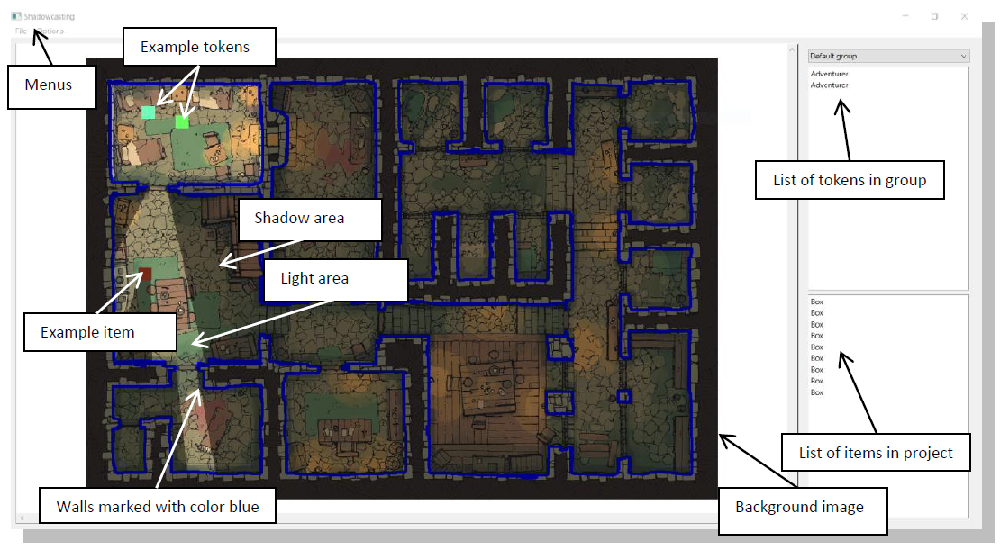
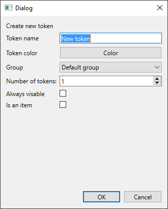
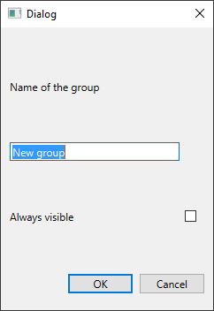

# ShadowCast

ShadowCast is a simple  [virtual tabletop](https://www.dnd-compendium.com/dm-resources/virtual-tabletops) application that can be used to simiulate field of view for your RPG games.

## Table of Contents
* [Usage](Usage)
* [Technologies](Technologies)
* [Addational information](Addational information)

## Usage
After launching you will be greated with a new file. There you can start adding tokens and drawing walls. If you want to use some background image for your map, start from loading it as resising resets created walls. Projects can be saved or loaded via file menu. An example project file can be found in main folder called "Presentation.sc"

You have option to create tokens, items and groups via options menu. From there you can also switch from drawing to erasing, change pens color or width and enable or disable displaying of certain element.

| Token creation      | Group creation|
| ------------- |-------------|
|   |  |

## Technologies
This project uses [Qt framework](https://www.qt.io/) under [LGPL license](https://www.gnu.org/licenses/lgpl-3.0.en.html).

## Addational information
Background image in Presentation.sc file and on the example screenshot can be found [here](https://2minutetabletop.com/dungeon-jail-prison-battle-map/). I'm not the owner of this graphic.
